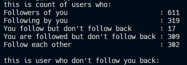
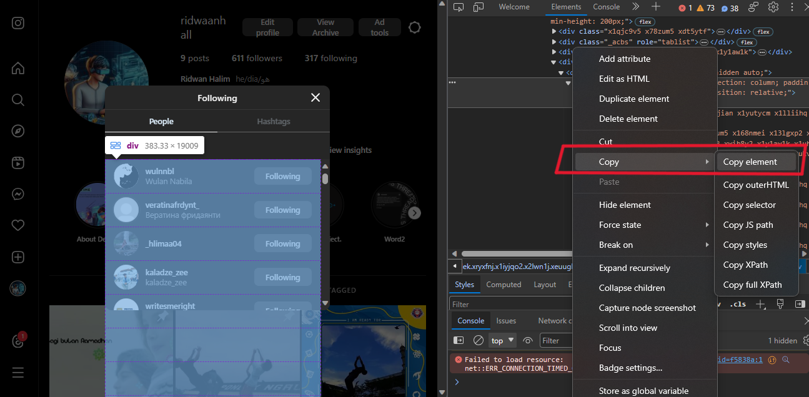

# Check Following Followers Instagram

## Description
This project serves as a tool for processing and analyzing data. It provides insights into our followers, following, mutual followers, and users we follow but who don't follow back.

## Installation
1. Make sure you have Python installed on your computer. [Download Python](https://www.python.org/downloads/)
2. Download the project or copy the code into your project.
3. Install the required library by running the following command in the terminal or command prompt:

## Before Usage (DON'T SKIP THIS STEP)

1. Open your instagram account and navigate to the following page: https://www.instagram.com/username/
2. Click on the "Followers" button.
3. Inspect the followers page and extract the HTML code. Make sure to scroll down to the bottom of the page.
4. Click on the "Following" button.
5. Inspect the following page and extract the HTML code. Make sure to scroll down to the bottom of the page.
6. Copy and paste the HTML code into a text file.
7. For followers, place the HTML code in the `01_process` directory with the name `followers_html.txt`.
8. For following, place the HTML code in the `01_process` directory with the name `following_html.txt`.

## Usage
1. Place change data inside the txt file from an Instagram follower and following in the `01_process` directory with the name `followers_html.txt` and `following_html.txt`.
2. Run the script `03_save_followers_data.py` to extract and save follower data.
3. Run the script `04_save_following_data.py` to extract and save following data.
4. View the results in the `followers_data.csv`, `followers_data.txt`, `following_data.csv`, and `following_data.txt` files.
5. In the `02_analyze` directory, run the script `01_knowing_data.py`. This script will analyze the data and show followers and following counts.
6. Run the script `02_checking_data.py`. This script will analyze the data and show users we follow, users who follow us, users who don't follow us back, users we don't follow but follow us, and users who follow each other with us. with add list of users who don't follow back.

## Contribution
If you would like to contribute to this project, please create a pull request and let us know about the proposed changes.

## License
This project is licensed under the MIT License.

---
**Note**: Be sure to replace or adjust certain sections as needed for your project's specifics. For followers and following under 1500.
